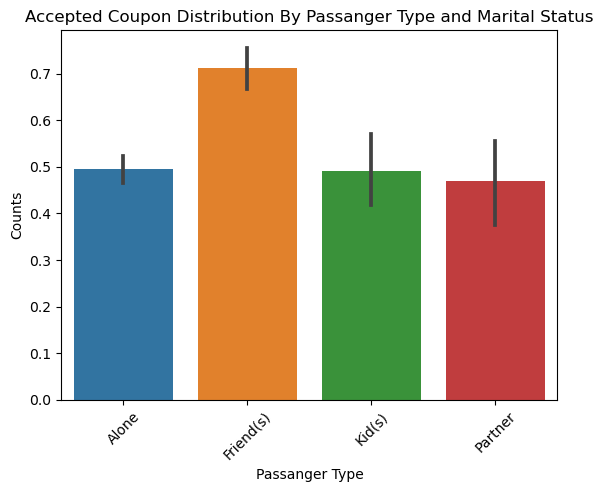

# Will-a-Customer-Accept-the-Coupon? #

#### Overview: ####

The goal of this project is to use what you know about visualizations and probability distributions to distinguish between customers who accepted a driving coupon versus those that did not.

## Investigation ##

The idea of ​​this study is to analyze the probability of a customer accepting a promotional coupon while driving depending on different types of factors. I based my research on drivers who were unemployed since after analyzing the distribution of occupations, I realized that it was the most common occupation within the dataframe.

### Analysis: ###

Now I will investigate the acceptance rate by occupation and sort the information in descending order to find out which Occupation has the highest acceptance rate.

#### Plot 1 ####

Acceptance rate of Coupons by Occupation

####  Conclusion 1 ####
The occupation with the highest acceptance rate is Healthcare Practitioners & Technical and the one with the lowest acceptance rate is "Retired"

#### Plot 2 ####

Now let's review unemployed drivers, which is the occupation with most data in this data frame.

we filtered the data frame with just the unemployed drivers, and make some analysis for example, which is the coupon that unemployed people accept the most.

####  Conclusion 2 ####

Reviewing the plot The coupon that unemployed people use the most is the "Coffee House" coupon and the one they use the least is the one for the most expensive restaurants

#### Plot 3 ####

now I'm going to analyze the use of the coffee coupon by people who were unemployed, on Sunny days and whose temperatures were equal or greater than 55 compared to other climates and other temperatures

####  Conclusion 3 ####

The acceptance rate of unemployed people who use the coupon on sunny days with temperatures above 55 is 15% higher than in other climates. We can also see how the climate with the highest acceptance rate is sunny at a temperature of 80.

#### Plot 4 ####

Now I will focus on analyzing the information for the passengers carried by the driver of unemployed occupation.

####  Conclusion 4 ####

We can reach the conclusion that drivers who are unemployed and who are with friends in the car and who are under 25 years old have 9% higher Acceptance Rate than the other drivers.

#### Plot 5 ####

Finally we are going to carry out an analysis of the drivers who are unemployed and single, comparing when they go "Home" vs when they go to "No Urgent Place"

####  Conclusion 5 ####

We can also conclude that drivers who are single and who are going to a "No Urgent Place" destination are 15% more likely to accept the coupon than those who are going home